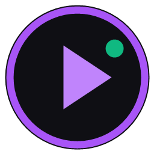

<p align="center">
  
</p>

<h1 align="center">StreamHub</h1>

<p align="center">
  <b>StreamHub</b>: Standalone donation dashboard, moderation queue and OBS overlay engine for live streamers.
</p>

<p align="center">
  <b><a href="#-english">🇬🇧 English</a></b> | <b><a href="#-русский">🇷🇺 Русский</a></b>
</p>

---

## 🇬🇧 English

### 📌 Overview
**StreamHub** is an offline-capable, standalone desktop application built on **Electron** and **Express**. It intercepts incoming donation alerts from DonationAlerts in real time via an isolated background web worker, hosts a local OBS browser overlay, provides deep moderation tools, renders financial analytics, and maintains persistent local storage without requiring external databases.

---

### 🚀 Download Ready Binaries
Pre-compiled Windows executables are available on the **[Releases](../../releases)** tab:
* **`StreamHub-Portable.exe`**: Zero installation required. Keeps `database.json` directly adjacent to the `.exe` file. Perfect for running from a USB drive or custom folders.
* **`StreamHub-Setup.exe`**: Standard Windows NSIS installer. Creates Desktop and Start Menu shortcuts, and manages persistence securely inside `%APPDATA%\StreamHub`.

---

### 📖 Complete User and Feature Manual

#### I. First Launch and Alert Sync (Settings Tab)
* Open the application and switch to the **Settings** tab via the sidebar navigation menu.
* Enter your unique **DonationAlerts Widget URL** into the input field (obtained from your DonationAlerts dashboard: *Widgets -> Alerts -> Show link for embedding*).
* Click the **Connect Alerts** button. The connection badge will turn green to confirm the background worker initialization.
* ⚠️ **Important Troubleshooting Rule:** Whenever you restart the application (before or during a live stream), always open **Settings** and click **Connect Alerts** again. This guarantees that the background worker hooks into the alert socket and eliminates desync issues.

#### II. OBS Studio Integration (Overlay Tab)
* StreamHub operates a local Express server on port `3939`:
  ```text
  http://localhost:3939/overlay
  ```
* **Adding to OBS Studio:**
  1. In OBS Studio, click the **+** button under Sources and select **Browser Source**.
  2. Set the URL to: `http://localhost:3939/overlay`.
  3. Set Width to `1920` and Height to `1080` (or match your canvas resolution).
  4. Check the box **Shutdown source when not visible** (recommended).
* **Customizing Appearance:**
  * Adjust notification duration, font scale, accent colors, and custom sound effects directly inside the **Overlay** tab, then click **Save Changes**.

#### III. Moderation Queue (Dashboard Tab)
* Incoming donations are automatically sorted into three distinct tabs:
  * **New**: Live alerts requiring your review.
  * **Deferred**: Alerts postponed during intense gaming situations.
  * **Processed**: Completed and acknowledged donations.
* **Hardware Hotkeys:**
  * `Space`: Instantly mark the highlighted donation as processed.
  * `Arrow Up` / `Arrow Down`: Navigate through the donation list without using a mouse.

#### IV. Analytics and Financial Charts
* Monitor revenue breakdowns filtered by: **Today**, **Week**, **Month**, and **All-Time**.
* Interactive charts render total amount received, top single tips, and average donation amount per user.

#### V. Donator Leaderboard
* Real-time ranking automatically calculates top supporters based on total cumulative donations and highest single contributions.

#### VI. Fake Alert Emulator (Testing Suite)
* Test your visual and audio setup before going live without spending money.
* Input a test username, amount, currency, and custom message.
* Click **Send Test Alert**: it triggers the OBS browser widget, plays audio, and appends a record to the queue for layout verification.

---

### 🛠️ Building from Source (Detailed Developer Guide)

#### Prerequisites
* **Node.js**: Version 18.0.0 or higher ([Download from official website](https://nodejs.org/)). Verify installation by typing `node -v` in your terminal.
* **Git**: Installed for cloning repositories, or download the source code as a ZIP archive.
* **Operating System**: Windows 10/11 (64-bit recommended).

#### Step-by-Step Build Instructions

1. **Clone the repository:**
   ```bash
   git clone [https://github.com/GamerNamless/StreamHub.git](https://github.com/GamerNamless/StreamHub.git)
   cd StreamHub
   ```

2. **Navigate into the project source folder:**
   Since the source files (`package.json`, `main.js`, etc.) are located inside `StreamHub_Source`, change directory into it:
   ```bash
   cd StreamHub_Source
   ```

3. **Install dependencies:**
   Run npm to download all required modules (`electron`, `express`, `electron-builder`):
   ```bash
   npm install
   ```
   Wait for the installation to finish (a `node_modules` folder will be created locally).

4. **Run in development mode (Test run):**
   To test the application locally without compiling:
   ```bash
   npm start
   ```

5. **Compile production executables (.exe):**
   * **Portable Version (.exe)** (standalone executable, creates `database.json` next to itself):
     ```bash
     npx electron-builder --win portable
     ```
   * **Installer Version (.exe)** (standard Windows Setup wizard):
     ```bash
     npx electron-builder --win nsis
     ```
   * **Both distributions at once**:
     ```bash
     npx electron-builder --win
     ```

6. **Locating your built files:**
   After electron-builder completes packaging, an output folder named `dist` will be generated inside `StreamHub_Source`. Open it to access your newly generated executable files:
   ```text
   StreamHub_Source/dist/
   ```

---

## 🇷🇺 Русский

### 📌 Описание
**StreamHub**: автономное настольное приложение на базе **Electron** и **Express**, созданное для стримеров. Программа перехватывает донаты из DonationAlerts в реальном времени через изолированный фоновый процесс, поднимает локальный сервер оверлея для OBS Studio, предоставляет модерацию очереди сообщений, отображает детальную аналитику и сохраняет все данные локально.

---

### 🚀 Скачать готовые сборки
Готовые исполняемые файлы под Windows опубликованы во вкладке **[Releases](../../releases)**:
* **`StreamHub-Portable.exe`**: Портативная сборка. Не требует установки, файл базы данных `database.json` создается прямо рядом с программой (удобно для запуска с флешки или отдельной папки).
* **`StreamHub-Setup.exe`**: Полноценный установщик Windows (NSIS). Создает ярлыки на Рабочем столе и в меню «Пуск», сохраняя базу данных в безопасной системной папке `%APPDATA%\StreamHub`.

---

### 📖 Полное руководство пользователя

#### I. Первоначальная настройка и подключение (Вкладка «Настройки»)
* Открой приложение и перейди во вкладку **Настройки** на боковой панели интерфейса.
* Вставь свою **ссылку на виджет оповещений DonationAlerts** в соответствующее поле (ссылку можно скопировать в панели DA: *Виджеты -> Оповещения -> Показать ссылку для встраивания*).
* Нажми кнопку **Подключить алерты**. Индикатор подключения станет зеленым, подтверждая успешный запуск фонового процесса.
* ⚠️ **Решение возможных проблем при перезапуске:** При каждом перезапуске программы (перед началом трансляции или во время нее) обязательно зайди во вкладку **Настройки** и нажми **Подключить алерты** еще раз. Это гарантированно перезапускает фоновый перехватчик сообщений и исключает рассинхронизацию.

#### II. Подключение оверлея к OBS Studio (Вкладка «Оверлей»)
* Встроенный сервер StreamHub раздает оверлей по локальному адресу:
  ```text
  http://localhost:3939/overlay
  ```
* **Добавление в OBS Studio:**
  1. В OBS Studio в списке источников нажми **+** и выбери **Браузер** (Browser Source).
  2. В поле URL вставь: `http://localhost:3939/overlay`.
  3. Укажи ширину `1920` и высоту `1080` (под разрешение твоей сцены).
  4. Поставь галочку **Обновлять браузер, когда сцена становится активной**.
* **Настройка оформления:**
  * В приложении во вкладке оверлея можно настроить цвета, размер шрифта, длительность показа плашки и нажать **Сохранить изменения**.

#### III. Модерация очереди донатов (Главная вкладка)
* Все поступающие донаты автоматически распределяются по вкладкам:
  * **Новые**: входящие донаты, требующие внимания стримера.
  * **Отложенные**: сообщения, отложенные во время важного игрового раунда.
  * **Прочитанные**: завершенные оповещения.
* **Горячие клавиши:**
  * `Пробел (Space)`: мгновенно отметить выбранный донат прочитанным.
  * `Стрелки вверх / вниз`: навигация по списку очереди без участия мыши.

#### IV. Аналитика и графики
* Фильтрация статистики по периодам: **Сегодня**, **Неделя**, **Месяц**, **Всё время**.
* Наглядные графики отображают динамику сборов, распределение платежей и среднюю сумму доната.

#### V. Таблица лидеров (Лидерборд)
* Автоматически ранжирует топ зрителей канала по суммарной сумме поддержки, а также фиксирует рекордный максимальный донат.

#### VI. Тестирование алертов (Фейк-донат)
* Инструмент для быстрой проверки внешнего вида и звука оверлея перед трансляцией.
* Заполни имя зрителя, тестовую сумму, валюту и текст сообщения.
* Нажми **Отправить тест**: оверлей мгновенно проиграет анимацию в OBS, а донат отобразится в очереди программы.

---

### 🛠️ Сборка из исходников (Подробное руководство разработчика)

#### Что понадобится перед началом
* **Node.js**: версия 18.0.0 или новее ([Скачать с официального сайта](https://nodejs.org/)). Для проверки в терминале введи `node -v`.
* **Git**: для клонирования репозитория (или можно скачать репозиторий архивом через кнопку Code -> Download ZIP).
* **Операционная система**: Windows 10 или 11 (64-bit).

#### Пошаговый процесс сборки

1. **Клонируй репозиторий через терминал:**
   ```bash
   git clone [https://github.com/GamerNamless/StreamHub.git](https://github.com/GamerNamless/StreamHub.git)
   cd StreamHub
   ```

2. **Перейди в папку с файлами проекта:**
   Так как все исходные файлы и конфиг сборщика находятся внутри папки `StreamHub_Source`, перейди внутрь нее:
   ```bash
   cd StreamHub_Source
   ```

3. **Установи зависимости:**
   Выполни команду для скачивания Electron и модулей:
   ```bash
   npm install
   ```
   Дождись окончания загрузки пакетов (в папке появится каталог `node_modules`).

4. **Проверка работоспособности (Dev-запуск):**
   Чтобы запустить программу прямо из исходников без сборки файла:
   ```bash
   npm start
   ```

5. **Компиляция готовых исполняемых файлов (.exe):**
   * **Портативная версия (.exe)** (не требует установки, сохраняет `database.json` рядом с собой):
     ```bash
     npx electron-builder --win portable
     ```
   * **Установщик (.exe)** (стандартный мастер установки Windows):
     ```bash
     npx electron-builder --win nsis
     ```
   * **Сборка обоих вариантов одновременно**:
     ```bash
     npx electron-builder --win
     ```

6. **Где забрать собранные файлы:**
   После завершения сборки electron-builder создаст внутри `StreamHub_Source` папку `dist`. Все готовые исполняемые файлы будут лежать в ней:
   ```text
   StreamHub_Source/dist/
   ```

---

## 📄 License
Распространяется под свободной лицензией **MIT License**.
